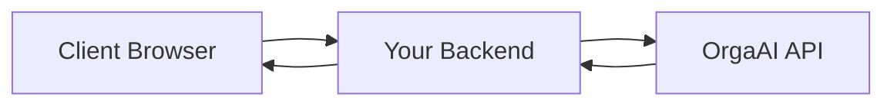

# Orga Web SDK

The Orga Web SDK enables real-time AI-powered audio and video features in your React web applications using a simple context and hook-based API.

---

## Project Overview

- **Purpose:** Integrate Orga AI for real-time audio and video interaction in React web apps.
- **Platform:** React Web (supports React context, works with most React-based web projects).

---

## Installation

Install the SDK from npm:

```sh
npm install @orga-ai/sdk-web
```

---

## Quick Start

Get up and running in minutes with a complete working example:

### 1. Set Up Environment Variables

Create a `.env.local` file in your project root:

```env
ORGA_API_KEY=your_orga_api_key_here
ORGA_DEV_EMAIL=your_developer_email@example.com
```

> **Note:** Get your API key from the OrgaAI dashboard. Never commit this file to version control.

### 2. Create the API Route

Create the backend endpoint for fetching ephemeral tokens:

```ts
// app/api/orga-ephemeral/route.ts
import { NextResponse } from "next/server";

const ORGA_API_KEY = process.env.ORGA_API_KEY;
const USER_EMAIL = process.env.ORGA_DEV_EMAIL;

const fetchIceServers = async (ephemeralToken: string) => {
  const URL = `https://api.orga-ai.com/ice-config`;
  try {
    const iceServersResponse = await fetch(URL, {
      method: "GET",
      headers: {
        Authorization: `Bearer ${ephemeralToken}`,
      },
    });
    if (!iceServersResponse.ok) {
      return NextResponse.json({ error: "Failed to fetch ICE servers" }, { status: 500 });
    }
    const data = await iceServersResponse.json();
    return data.iceServers;
  } catch (error) {
    return NextResponse.json({ error: "Internal server error" }, { status: 500 });
  }
};

export const GET = async () => {
  if (!USER_EMAIL) {
    return NextResponse.json(
      { error: 'Missing ORGA_DEV_EMAIL environment variable' }, 
      { status: 500 }
    );
  }

  if (!ORGA_API_KEY) {
    return NextResponse.json(
      { error: 'Missing ORGA_API_KEY environment variable' }, 
      { status: 500 }
    );
  }

  const apiUrl = `https://api.orga-ai.com/ephemeral-token?email=${encodeURIComponent(USER_EMAIL)}`;
  const ephemeralResponse = await fetch(apiUrl, {
    method: "POST",
    headers: {
      Authorization: `Bearer ${ORGA_API_KEY}`,
    },
  });
    
  if (!ephemeralResponse.ok) {
    return NextResponse.json(
      { error: 'Failed to fetch ephemeral token' }, 
      { status: ephemeralResponse.status }
    );
  }

  const data = await ephemeralResponse.json();
  const iceServers = await fetchIceServers(data.ephemeral_token);
  const returnData = {
    iceServers,
    ephemeralToken: data.ephemeral_token
  }
  return NextResponse.json(returnData);
}
```

### 3. Initialize the SDK

```tsx
//app/providers/OrgaClientProvider.tsx (Client Component)
'use client'
import { OrgaAI, OrgaAIProvider } from '@orga-ai/sdk-web';

OrgaAI.init({
  logLevel: 'debug',
  fetchSessionConfig: async () => {
    const response = await fetch('/api/orga-ephemeral');
    const { ephemeralToken, iceServers } = await response.json();
    return { ephemeralToken, iceServers };
  },
  model: 'orga-1-beta',
  voice: 'alloy',
});

export function OrgaClientProvider({ children }: { children: React.ReactNode }) {
  return <OrgaAIProvider>{children}</OrgaAIProvider>;
}
```

### 4. Wrap Your App with the Provider

```tsx
// app/layout.tsx
import { OrgaClientProvider } from './providers/OrgaProvider';

export default function RootLayout({
  children,
}: Readonly<{
  children: React.ReactNode;
}>) {
  return (
    <html lang="en">
      <body>
          <OrgaClientProvider>
            {children}
          </OrgaClientProvider>
      </body>
    </html>
  );
}
```

### 5. Use the Hook in Your Components

```tsx
// app/page.tsx (Client Component)
'use client'
import { useOrgaAI, OrgaVideo, OrgaAudio } from '@orga-ai/sdk-web';

export default function Home() {
  const {
    startSession,
    endSession,
    userVideoStream,
    aiAudioStream,
    connectionState,
    isCameraOn,
    toggleCamera,
    toggleMic,
    isMicOn,
  } = useOrgaAI();

  const handleStart = async () => {
    await startSession({
      onSessionConnected: () => {
        console.log("Connected!");
      },
    });
  };

  return (
    <div className="min-h-screen bg-gray-50 p-8">
      <div className="max-w-2xl mx-auto">
        <h1 className="text-3xl font-bold text-center mb-8">
          OrgaAI SDK Quick Start
        </h1>

        <div className="bg-white rounded-lg shadow-md p-6 mb-6">
          <h2 className="text-xl font-semibold mb-4">Camera Preview</h2>
          <div className="relative bg-gray-900 rounded-lg overflow-hidden">
            <OrgaVideo
              stream={userVideoStream}
              className="w-full h-64 object-cover"
            />
            {!userVideoStream && (
              <div className="absolute inset-0 flex items-center justify-center text-gray-400">
                <p>Camera preview will appear here</p>
              </div>
            )}
          </div>
        </div>

        <div className="bg-white rounded-lg shadow-md p-6 mb-6">
          <h2 className="text-xl font-semibold mb-4">Controls</h2>
          <div className="mb-4 p-3 bg-gray-100 rounded-lg">
            <span className="font-medium">Status: {connectionState}</span>
          </div>

          <div className="space-y-3">
            <button
              onClick={handleStart}
              disabled={
                connectionState === "connected" ||
                connectionState === "connecting"
              }
              className="w-full bg-blue-600 hover:bg-blue-700 disabled:bg-gray-400 text-white py-2 px-4 rounded-lg"
            >
              {connectionState === "connecting"
                ? "Connecting..."
                : "Start Session"}
            </button>

            <button
              onClick={endSession}
              disabled={connectionState !== "connected"}
              className="w-full bg-red-600 hover:bg-red-700 text-white py-2 px-4 rounded-lg"
            >
              End Session
            </button>

            <div className="grid grid-cols-2 gap-3">
              <button
                onClick={toggleCamera}
                disabled={connectionState !== "connected"}
                className={`py-2 px-4 rounded-lg ${
                  isCameraOn
                    ? "bg-green-600 text-white"
                    : "bg-gray-200 text-gray-700"
                }`}
              >
                {isCameraOn ? "Camera On" : "Camera Off"}
              </button>

              <button
                onClick={toggleMic}
                disabled={connectionState !== "connected"}
                className={`py-2 px-4 rounded-lg ${
                  isMicOn
                    ? "bg-green-600 text-white"
                    : "bg-gray-200 text-gray-700"
                }`}
              >
                {isMicOn ? "Mic On" : "Mic Off"}
              </button>
            </div>
          </div>
        </div>
        <OrgaAudio stream={aiAudioStream} />
      </div>
    </div>
  );
}
```

> **Note:** For Next.js or SSR projects, ensure the provider and hooks are only used in client components.

---

## Why the Proxy Endpoint?

The OrgaAI SDK requires a **proxy endpoint** on your backend server. This is a **security requirement**, not an optional pattern.

### **Security Architecture**



**Why this pattern is required:**

1. **API Keys Must Stay Server-Side**
   - Your OrgaAI API key contains sensitive credentials
   - If exposed to the client, anyone could use your account
   - The proxy keeps your API key secure on your server

2. **Full Control**
   - Rate limiting per user
   - Custom authentication
   - Audit logging
   - Business logic integration

### **What the Proxy Does**

Your backend endpoint (`/api/orga-ephemeral`) acts as a secure bridge:

1. **Receives request** from your client
2. **Uses your API key** to call OrgaAI (server-side)
3. **Returns ephemeral token** to client (safe to expose)
4. **Client uses ephemeral token** for WebRTC connection

This ensures your API key never leaves your server while providing secure access to OrgaAI features.

---

## Configuration

You **must** initialize the SDK before use, providing a `fetchSessionConfig` function. This function should securely fetch an ephemeral token and ICE servers from your backend using your API key.

**Never expose your API key in client code.**

```ts
import { OrgaAI } from '@orga-ai/sdk-web';

OrgaAI.init({
  fetchSessionConfig: async () => {
    // Call your backend to get ephemeralToken and iceServers
    const response = await fetch('/api/orga-ephemeral');
    const { ephemeralToken, iceServers } = await response.json();
    return { ephemeralToken, iceServers };
  },
});
```

---

## Secure Backend Example for Ephemeral Token & ICE Servers

**Never expose your OrgaAI API key in client code. Always use a secure backend to fetch ephemeral tokens and ICE servers.**

---

> **Summary:**
> - Always keep your OrgaAI API key and developer email on a secure backend.
> - Never expose them in your app or client-side code.
> - The client (web or mobile) should only call your backend, never OrgaAI directly.

---

## OrgaAI.init Configuration Options

The `OrgaAI.init(config)` method accepts the following options:

| Option                          | Type      | Description                                                                                 | Default      | Required? |
|----------------------------------|-----------|---------------------------------------------------------------------------------------------|--------------|-----------|
| `logLevel`                      | `"debug" \| "info" \| "warn" \| "error" \| "disabled"` | Logging verbosity.                                    | `"disabled"`     | No        |
| `timeout`                       | `number`  | Timeout for requests, in milliseconds.                                                      | `30000`      | No        |
| `ephemeralEndpoint`             | `string`  | URL to your backend endpoint for fetching ephemeral tokens and ICE servers.                 | —            | Yes*      |
| `fetchSessionConfig` | `() => Promise<{ ephemeralToken: string; iceServers: RTCIceServer[] }>` | Custom function to fetch ephemeral token and ICE servers. | —            | Yes*      |
| `enableTranscriptions` | `boolean` | Whether to return transcription data in the session. | `false`           | No      |
| `instructions`                  | `string`  | Custom instructions for the AI in this session.                                            | —            | No | 
| `model`                         | `OrgaAIModel` | Model to use (see SDK for allowed values).                                                 | —            | No        |
| `voice`                         | `OrgaAIVoice` | Voice to use (see SDK for allowed values).                                                 | —            | No        |
| `temperature`                   | `number`  | Sampling temperature (randomness). Must be between allowed min/max.                         | —            | No        |

> **Note:** Either `ephemeralEndpoint` **or** `fetchSessionConfig` is required.

### Example

```ts
OrgaAI.init({
  logLevel: 'debug',
  timeout: 30000,
  fetchSessionConfig: async () => {
    // Your backend call here
    return { ephemeralToken: '...', iceServers: [] };
  },
  model: 'orga-1-beta',
  voice: 'alloy',
  temperature: 0.7,
});
```

#### Descriptions

- **logLevel:** Controls the verbosity of SDK logs. Use `"debug"` for development, `"warn"` or `"error"` for production.
- **timeout:** How long (in ms) the SDK will wait for backend responses before timing out.
- **ephemeralEndpoint:** If provided, the SDK will call this endpoint to fetch tokens/ICE servers. Should be a backend endpoint you control.
- **fetchSessionConfig:** If provided, the SDK will use this function to fetch tokens/ICE servers. This gives you full control.
- **model:** The AI model to use. See SDK for allowed values.
- **voice:** The voice to use for audio output. See SDK for allowed values.
- **temperature:** Controls randomness in AI responses. Must be within allowed range.

---

## Session Configuration

When calling `startSession(config)`, you can pass configuration options that will override the global settings from `OrgaAI.init()`. This allows you to customize each session independently.

### Session Configuration Options

| Option                          | Type      | Description                                                                                 | Default      |
|----------------------------------|-----------|---------------------------------------------------------------------------------------------|--------------|
| `enableTranscriptions`          | `boolean` | Whether to return transcription data in the session.                                        | `false`      |
| `videoQuality`                  | `"low" \| "medium" \| "high"` | Video quality for camera stream.                                                      | `"medium"`   |
| `timeout`                       | `number`  | Session-specific timeout (overrides global timeout).                                        | Global timeout|
| `model`                         | `OrgaAIModel` | AI model to use for this session (overrides global model).                           | Global model  |
| `voice`                         | `OrgaAIVoice` | Voice to use for this session (overrides global voice).                               | Global voice  |
| `temperature`                   | `number`  | Temperature for this session (overrides global temperature).                               | Global temp   |
| `instructions`                  | `string`  | Custom instructions for the AI in this session.                                            | —            |
| `modalities`                    | `Modality[]` | Audio/video modalities for this session (overrides global).                        | Global modalities|

### Session Callbacks

You can also pass callbacks to handle session events:

| Callback                        | Type      | Description                                                                                 |
|----------------------------------|-----------|---------------------------------------------------------------------------------------------|
| `onSessionStart`                | `() => void` | Called when the session starts successfully.                                           |
| `onSessionEnd`                  | `() => void` | Called when the session ends (either manually or due to error).                      |
| `onSessionConnected`            | `() => void` | Called when the WebRTC connection is established.                                     |
| `onError`                       | `(error: Error) => void` | Called when an error occurs during the session.                                    |
| `onConnectionStateChange`       | `(state: ConnectionState) => void` | Called when the connection state changes (connecting, connected, failed, etc.). |
| `onConversationMessageCreated`  | `(item: ConversationItem) => void` | Called when a new conversation message is created (user speech or AI response). |

### Example Session Configuration

```tsx
const { startSession } = useOrgaAI();

const handleStartSession = async () => {
  await startSession({
    // Override global settings
    model: 'orga-1-beta',
    voice: 'alloy',
    temperature: 0.8,
    videoQuality: 'high',
    enableTranscriptions: true,
    
    // Session-specific instructions
    instructions: 'You are a helpful assistant. Speak clearly and concisely.',
    
    // Event callbacks
    onSessionStart: () => {
      console.log('Session started!');
    },
    onSessionConnected: () => {
      console.log('Connected to OrgaAI!');
    },
    onError: (error) => {
      console.error('Session error:', error);
    },
    onConversationMessageCreated: (item) => {
      console.log('New message:', item);
    },
  });
};
```

---

## Features

- **Simplified API:** Clean, intuitive interface with essential methods only
- **Automatic Modality Management:** Camera/mic toggles automatically update backend modalities
- **Enhanced Logging:** Configurable logging with timeline events for debugging
- **Session Configuration:** Override global settings per session
- **Real-time Audio/Video:** Seamless WebRTC integration
- **React Context:** Easy integration with React applications

---

## API Reference

### Components

- **OrgaAIProvider**
  - Provides Orga context to your React app. Wrap your app with this provider.
  - _Import:_
    ```tsx
    import { OrgaAIProvider } from '@orga-ai/sdk-web';
    ```
  - _Usage:_
    ```tsx
    <OrgaAIProvider>
      {/* ...your app... */}
    </OrgaAIProvider>
    ```

- **OrgaVideo**
  - Convenient wrapper for displaying video streams (camera preview).
  - _Import:_
    ```tsx
    import { OrgaVideo } from '@orga-ai/sdk-web';
    ```
  - _Props:_
    ```tsx
    type OrgaVideoProps = React.VideoHTMLAttributes<HTMLVideoElement> & {
      stream: MediaStream | null;
    };
    ```
  - _Usage:_
    ```tsx
    <OrgaVideo stream={userVideoStream} className="camera-preview" />
    ```

- **OrgaAudio**
  - Convenient wrapper for playing audio streams (AI responses).
  - _Import:_
    ```tsx
    import { OrgaAudio } from '@orga-ai/sdk-web';
    ```
  - _Props:_
    ```tsx
    type OrgaAudioProps = React.AudioHTMLAttributes<HTMLAudioElement> & {
      stream: MediaStream | null;
    };
    ```
  - _Usage:_
    ```tsx
    <OrgaAudio stream={aiAudioStream} />
    ```

### Hooks

- **useOrgaAI**
  - Access Orga SDK methods and state in your components.
  - _Import:_
    ```tsx
    import { useOrgaAI } from '@orga-ai/sdk-web';
    ```
  - _Returns:_
    ```tsx
    {
      // Session management
      startSession: (config?: SessionConfig) => Promise<void>;
      endSession: () => Promise<void>;

      // Media controls
      enableMic: () => Promise<void>;
      disableMic: () => Promise<void>;
      toggleMic: () => Promise<void>;
      enableCamera: () => Promise<void>;
      disableCamera: () => Promise<void>;
      toggleCamera: () => Promise<void>;

      // State
      connectionState: ConnectionState;
      aiAudioStream: MediaStream | null; // AI audio response
      userVideoStream: MediaStream | null; // Camera preview
      conversationItems: ConversationItem[];
      isCameraOn: boolean;
      isMicOn: boolean;
      conversationId: string | null;

      // Parameter management
      model: OrgaAIModel | null;
      voice: OrgaAIVoice | null;
      temperature: number | null;
      instructions: string | null;
      modalities: Modality[];
      updateParams: (params: {
        model?: OrgaAIModel;
        voice?: OrgaAIVoice;
        temperature?: number;
        instructions?: string;
        modalities?: Modality[];
      }) => void;
    }
    ```

### Advanced Usage Examples

#### Custom Media Handling

If you prefer to handle media streams manually instead of using the provided components:

```tsx
function CustomMediaComponent() {
  const { userVideoStream, aiAudioStream } = useOrgaAI();
  const videoRef = useRef<HTMLVideoElement>(null);
  const audioRef = useRef<HTMLAudioElement>(null);

  useEffect(() => {
    if (videoRef.current) {
      videoRef.current.srcObject = userVideoStream;
    }
  }, [userVideoStream]);

  useEffect(() => {
    if (audioRef.current) {
      audioRef.current.srcObject = aiAudioStream;
    }
  }, [aiAudioStream]);

  return (
    <div>
      <video 
        ref={videoRef} 
        autoPlay 
        playsInline 
        className="custom-video"
      />
      <audio 
        ref={audioRef} 
        autoPlay 
        hidden 
      />
    </div>
  );
}
```

#### Conditional Video Display

When using `OrgaVideo`, you'll typically want to show a placeholder when the camera is off or no stream is available:

```tsx
function VideoWithPlaceholder() {
  const { userVideoStream, isCameraOn } = useOrgaAI();

  return (
    <div className="video-container">
      {isCameraOn && userVideoStream ? (
        <OrgaVideo
          stream={userVideoStream}
          className="camera-feed"
        />
      ) : (
        <div className="placeholder">
          <div className="placeholder-icon">📹</div>
          <p>Camera is {isCameraOn ? 'loading...' : 'off'}</p>
        </div>
      )}
    </div>
  );
}
```

This pattern ensures:
- **Smooth UX:** Users see appropriate feedback
- **Performance:** Video component only mounts when needed
- **Flexibility:** Custom placeholder content for your app's design

---

## Troubleshooting

### Common Issues

1. **"fetchSessionConfig is not defined"**
   - Ensure you've called `OrgaAI.init()` with the required function
   - Check that your backend endpoint is working correctly

2. **Connection failures**
   - Check your backend ephemeral token endpoint
   - Verify ICE servers are being returned correctly
   - Check network connectivity

### Debugging

Enable debug logging to see detailed information:

```ts
OrgaAI.init({
  logLevel: 'debug',
  // ... other config
});
```

This will show you the complete timeline of events, making it easier to identify issues.

---

## Support

For issues, questions, or contributions, please refer to the SDK documentation or contact the OrgaAI team.